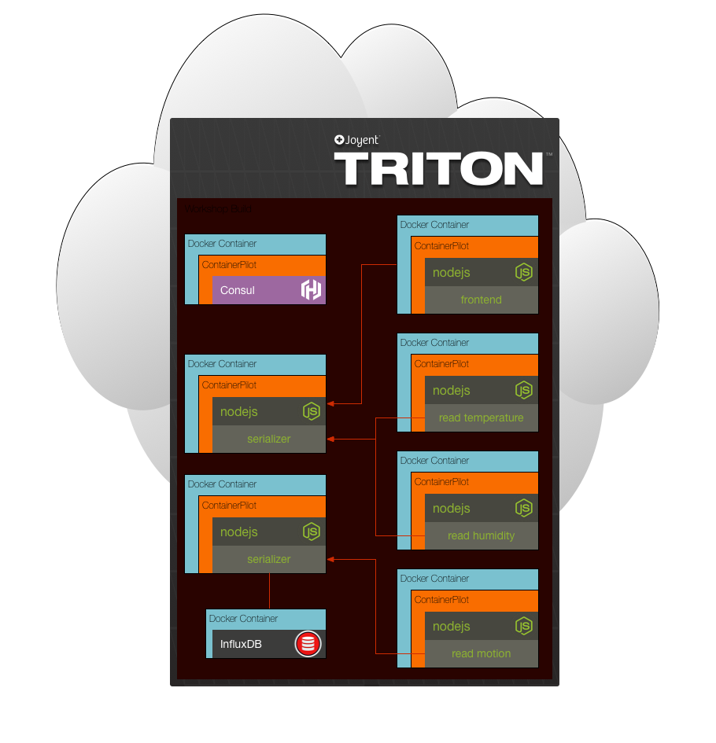

# Workshop for Node.js Microservices in Containers with ContainerPilot

Example microservices implementation using Node.js and Docker. Below is an architectural diagram depicting the composition of services that make up the project. When everything is working a frontend web application is accessible that will display a set of graphs using sensor data.

## Requirements

- [Docker](https://www.docker.com/community-edition#/download)
- [Node.js](https://nodejs.org/en/download/)

## Challenges

* Each challenge has its own folder
* Read the README.md for each challenge
* Each subsequent challenge has the solution to the previous challenge

## What we are Building

* Microservices that pull data from a SmartThings service
* Data is serialized and saved in InfluxDB
* Frontend presents the data as charts with live updates using WebSockets

## Concepts Presented

* Containers
* Service discovery
* Microservices
* Autopilot Pattern

## Credits

This project is inspired by various microservices workshops and trainings. In no particular order, they are:
* https://github.com/lloydbenson/microservices-workshop - Lloyd Benson
* https://github.com/nearform/micro-services-tutorial-iot - nearForm

# [Challenge 1](./challenge1/README.md)
