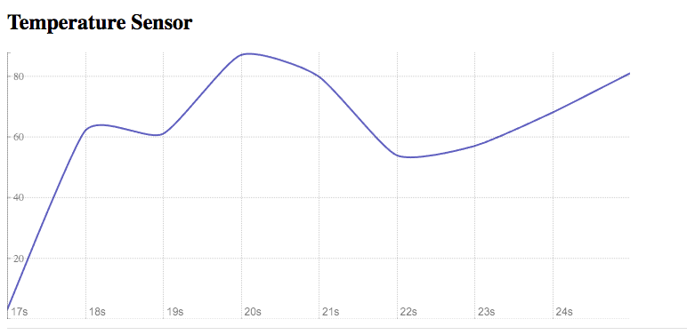
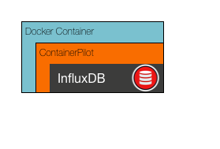

# Solution to Challenge 1

```sh
cd frontend/
npm install
PORT=10001 node .
```

Point your browser to [http://localhost:10001](). You should see a chart, like the one shown here:



## Challenge 2



Next we are going to start InfluxDB, which we will use to store sensor data. To do this we are going to take advantage of [Docker](https://docs.docker.com/engine/installation/). If you haven't done this already you can fetch the InfluxDB image by running:

```sh
docker pull influxdb:1.1.1-alpine
```

Documentation on how to start the container can be found [here](https://hub.docker.com/_/influxdb/).

Your challenge is to startup InfluxDB with the admin interface enabled. Once you have it running successfully, open your browser and review that you can access the web interface.

__hint__ InfluxDB should have ports 8083 and 8086 published

__hint__ Read the Docker CLI run [command reference](https://docs.docker.com/engine/reference/commandline/run/#options)

__hint__ InfluxDB requires the following environment variables are set

* `ADMIN_USER=root`
* `INFLUXDB_INIT_PWD=root`
* `INFLUXDB_ADMIN_ENABLED=true`

## Next Up: [Challenge 3](../challenge3/README.md)
