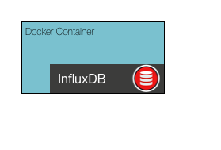

# Solution to Challenge 1

```sh
cd frontend/
npm install
PORT=10001 node .
```

Point your browser to [http://localhost:10001](). You should see a chart, like the one shown here:


## Challenge 2



Next we are going to start our service catalog. To do this we are going to take advantage of [Docker](https://docs.docker.com/engine/installation/). If you haven't done this already you can fetch the Autopilot Pattern Consul container by running:

```sh
docker pull autopilotpattern/consul:0.7r0.7
```

Documentation on how to start the container can be found [here](https://hub.docker.com/r/autopilotpattern/consul/).

Your challenge is to startup the Consul container. Once you have it running successfully, open your browser and review the Consul web interface.

__hint__ Consul is listening on port 8500


## Next Up: [Challenge 3](../challenge3/README.md)
