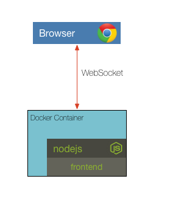

# Solution to Challenge 2

```sh
docker run -p 8083:8083 -p 8086:8086 -e "ADMIN_USER=root" -e "INFLUXDB_INIT_PWD=root" -e "INFLUXDB_ADMIN_ENABLED=true" --rm influxdb:1.1.1-alpine
```

Point your browser to [http://localhost:8083](). You should see the InfluxDB web interface.


## Challenge 3



Your challenge is to update the `Dockerfile` in the frontend folder so that it has the correct CMD to start the process. Once this is ready, test your solution by building the frontend image and running the container. Remember to pass the environment variable for the port to listen on.


__hint__ the frontend expects an environment variable named PORT

__hint__ refer to the [Dockerfile reference page](https://docs.docker.com/engine/reference/builder/)


## Next Up: [Challenge 4](../challenge4/README.md)
