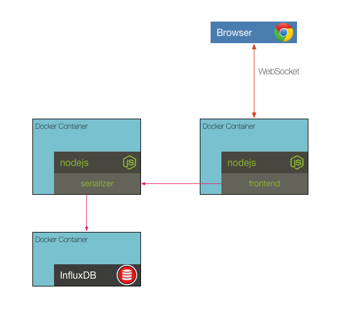

# Solution to Challenge 3

1. Update the Dockerfile with the CMD below
```sh
CMD ["node", "/opt/app/lib"]
```
2. Build the image with `docker build -t frontend .`
3. Create and run the container with `docker run -e PORT=10001 -p 10001:10001 --rm frontend`

Point your browser to [http://localhost:10001](). You should see the temperature chart.

## Challenge 4



The frontend needs to be connected to a service for retrieving temperature and other sensor data. For this purpose there is now a serializer service added. This service is already dockerized and expects to talk to an InfluxDB in order to read and write sensor data. Additionally, the frontend has been updated to accept the serializer host and port as new environment variables. For this particular challenge we are going to use the `1.1.1-alpine` tag for the official InfluxDB image.

Your challenge is to start the InfluxDB container, get the IP address for it, pass that to the serializer as environment variables and start it as well as the frontend. Once you have these up and running use the following curl command to send data to the serialization service and see it appear in the frontend.

curl command to add temperature data
```sh
curl -X POST -d '[{"value": 32}]' http://localhost:10000/write/temperature  --header "Content-Type:application/json"
```

__hint__ You will need to build both the frontend and serializer images first!

__hint__ If you look at the code in _serializer/lib/index.js_ you will notice that it uses the following environment variables:

* `INFLUXDB_HOST=IP-FOR-INFLUXDB`
* `INFLUXDB_USER=root`
* `INFLUXDB_PWD=root`
* `PORT=10000`

__hint__ If you look at the code in _frontend/lib/index.js_ you will notice that it uses the following environment variables:

* `SERIALIZER_HOST=IP-FOR-SERIALIZER`
* `SERIALIZER_PORT=10000`
* `PORT=10001`

__hint__ InfluxDB expects the following environment variables to create the correct database

* `ADMIN_USER=root`
* `INFLUXDB_INIT_PWD=root`

__hint__ Start each container with a `--name` option to make them easier to `inspect`

## Next Up: [Challenge 5](../challenge5/README.md)
