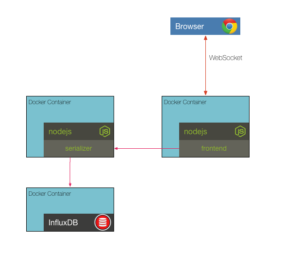

## Challenge 5



Instead of starting each container separately, we can use docker-compose to assemble them in a single command. Review the services in the provided _docker-compose.yml_ then start them all using `docker-compose up`. Test that everything is working correctly by opening the frontend in a web browser and pushing sensor data to the serializer.

curl command to add temperature data
```sh
curl -X POST -d '[{"value": 42}]' http://localhost:10000/write/temperature  --header "Content-Type:application/json"
```

__hint__ read about the [`docker-compose up`](https://docs.docker.com/compose/reference/up/) command


### [Solution](./SOLUTION.md)


## Next Up: [Challenge 6](../challenge6/README.md)
