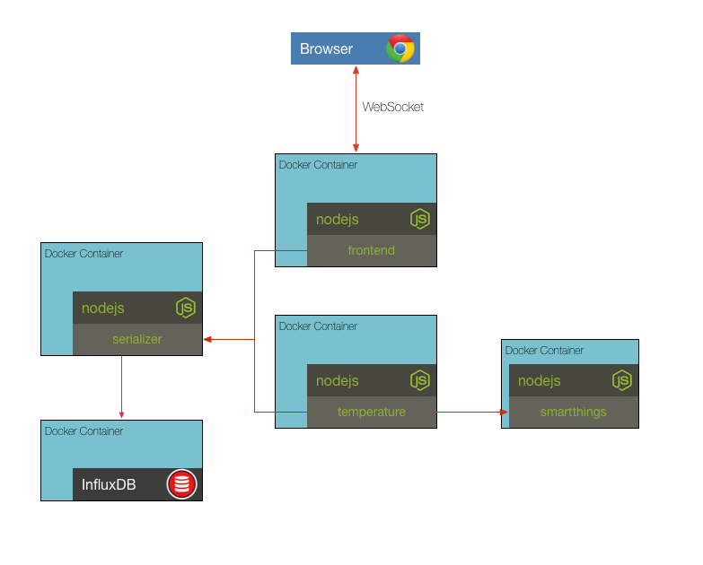

## Challenge 6

Instead of sending temperature data manually we will add a temperature sensor service that pushes temperature data to the serializer. The contents of this service have been added as a new folder named _sensor_. Additionally, there is also a smartthings service that is added that will supply the sensor with the correct data. Update the _docker-compose.yml_ file with the new services, setting the correct environment variables, then start everything and view the chart in the browser.

__hint__ the temperature sensor expects the following environment variables
* `SENSOR_TYPE=temperature`
* `PORT=10002`
* `SMARTTHINGS_HOST=smartthings`
* `SMARTTHINGS_PORT=10003`
* `SERIALIZER_HOST=serializer`
* `SERIALIZER_PORT=10000`

__hint__ the smartthings service expects the following environment variables
* `PORT=10003`

### [Solution](./SOLUTION.md)

## Next Up: [Challenge 7](../challenge7/README.md)
