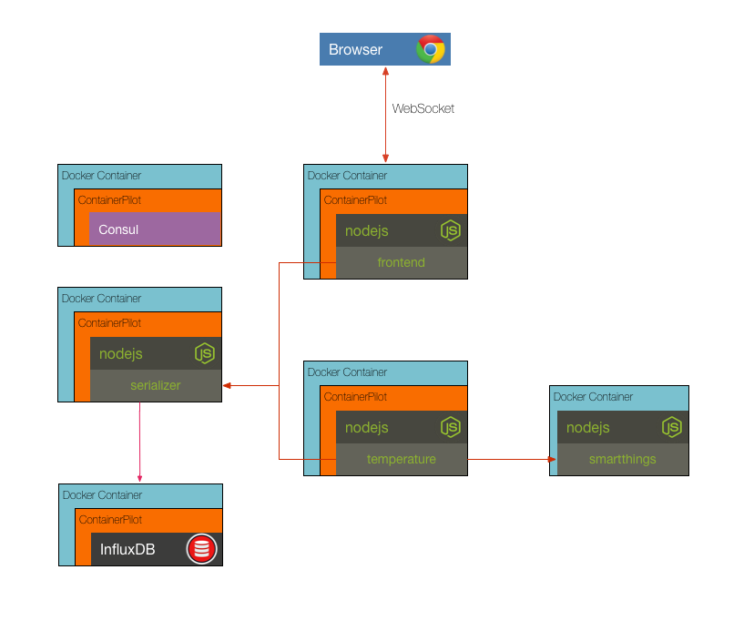

## Challenge 7

The existing solution is acceptable for local development, but we can't use the full features of docker-compose (scale), and we don't have a production ready solution. If we went to production with the existing setup and need to add more serializer instances we could put the serializer behind a load balancer and point our dependent services to the domain name for the balancer. This will require us to add a health check to the serializer and for each of dependent services to point to the load balancer address for the given environment. If the load balancer address needs to change we will need to restart the temperature and frontend. Also, to trully mimic production we should setup a load balancer locally.

Alternatively, we can implement the Autopilot Pattern and register our services with a service discovery catalog, like Consul. ContainerPilot is a solution that makes the registration and notification of dependency changes with Consul seamless. Furthermore, it also acts as an init process inside of Docker, which is something the current solution is lacking.

The Dockerfile for each service is updated with ContainerPilot and the Consul agent, additionally, the _docker-compose.yml_ is updated with Consul. Your challenge is to use docker-compose to bring everything up and then to scale the serializer to 2 or more instances. Verify everything is working by opening the Consul dashboard and observing that multiple serializers are registered. Also, open the frontend and verify that temperature data is still being shown.

__hint__ use docker-compose scale to add more instances of a container

### [Solution](./SOLUTION.md)

## Next Up: [Challenge 8](../challenge8/README.md)
