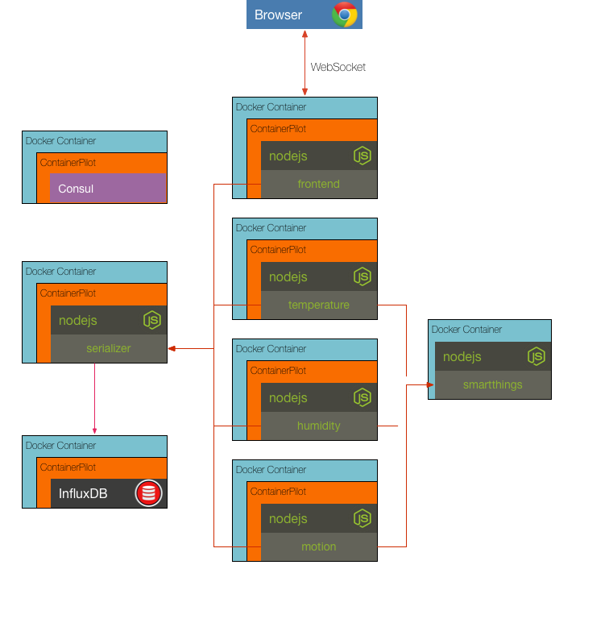

## Challenge 8

Add a humidity and motion sensor service to pull data from smartthings and push it to the serializer. These services will use the existing sensor image and set the `SENSOR_TYPE` appropriately. Add the services to the _docker-compose.yml_ and verify that the graphs in the frontend update.

__hint__ refer to the temperature service in the _docker-compose.yml_ as an example

### [Solution](./SOLUTION.md)

## Next Up: [Challenge 9](../challenge9/README.md)
