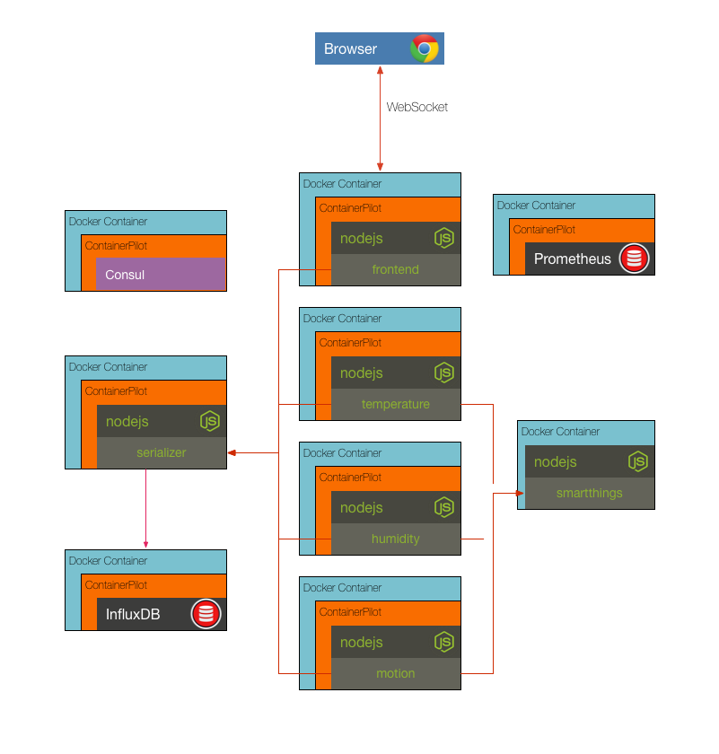

# Solution to Challenge 8

1. Update the _docker-compose.yml_ with the humidity and motion services, as shown below.
```
motion:
  build: ./sensor
  links:
    - consul:consul
    - smartthings:smartthings
  environment:
    - SENSOR_TYPE=motion
    - PORT=8080
    - SMARTTHINGS_HOST=smartthings
    - SMARTTHINGS_PORT=8080
    - CONSUL_HOST=consul
  restart: always
humidity:
  build: ./sensor
  links:
    - consul:consul
    - smartthings:smartthings
  environment:
    - SENSOR_TYPE=humidity
    - PORT=8080
    - SMARTTHINGS_HOST=smartthings
    - SMARTTHINGS_PORT=8080
    - CONSUL_HOST=consul
    - CONSUL=consul
  restart: always
```

2. Start the services `docker-compose up -d`

3. Point your browser to [http://localhost:10001](). You should see the graphs updating.

Cleanup the existing containers:
```
docker-compose down
```

## Challenge 9



ContainerPilot supports reporting on telemetry data to Prometheus. The _docker-compose.yml_ file has been updated with a Prometheus service that is discoverable from consul. Your challenge is to update the new telemetry entry in the frontend _containerpilot.json_ configuration with a sensor for the _memory.sh_ script to send free memory data to Prometheus.

__hint__ refer to the ContainerPilot [configuration telemetry documentation](https://www.joyent.com/containerpilot/docs/telemetry).

## Next Up: [final](../final/README.md)
