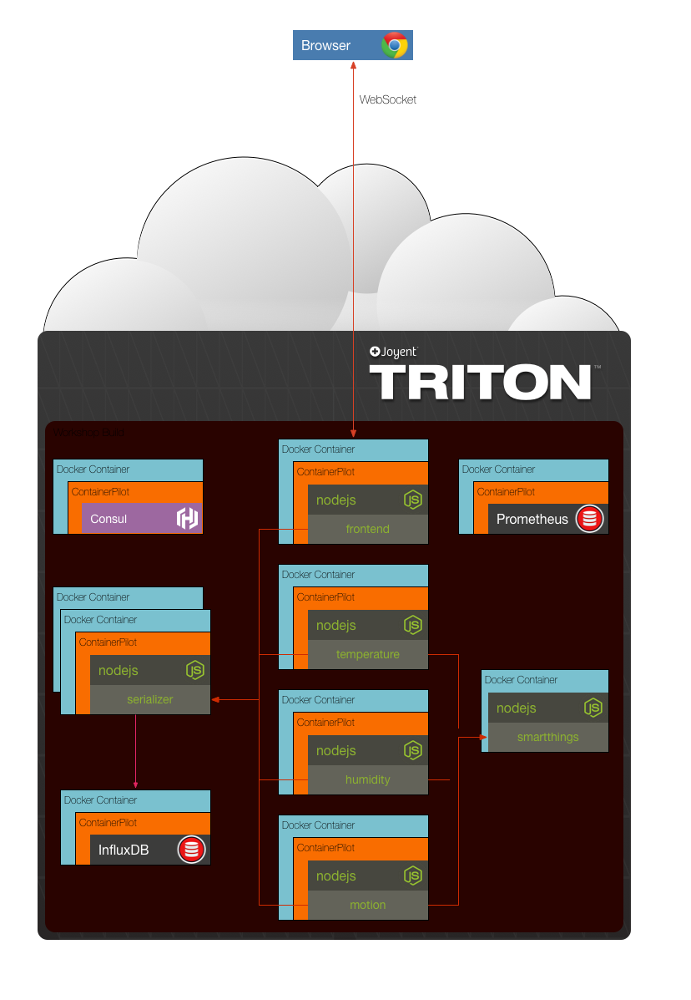

## Final - Take home assignment

All of the services are assembled and able to be deployed to production! You can scale any of the services up or down as needed. The _docker-compose.yml_ we were using in development has been renamed to _local-compose.yml_ and there is now a _docker-compose.yml_ that uses an environment file to determine the location of the consul instance in Triton. There is a _setup.sh_ script that will generate the environment file for you.

Your challenge is to deploy everything to Triton.

__hint__ Sign-up for a free Triton account: https://sso.joyent.com/signup

__hint__ Install the Triton CLI: `npm install -g triton`

### [Solution](./SOLUTION.md)

## Next Up: Systems We Love!!!
